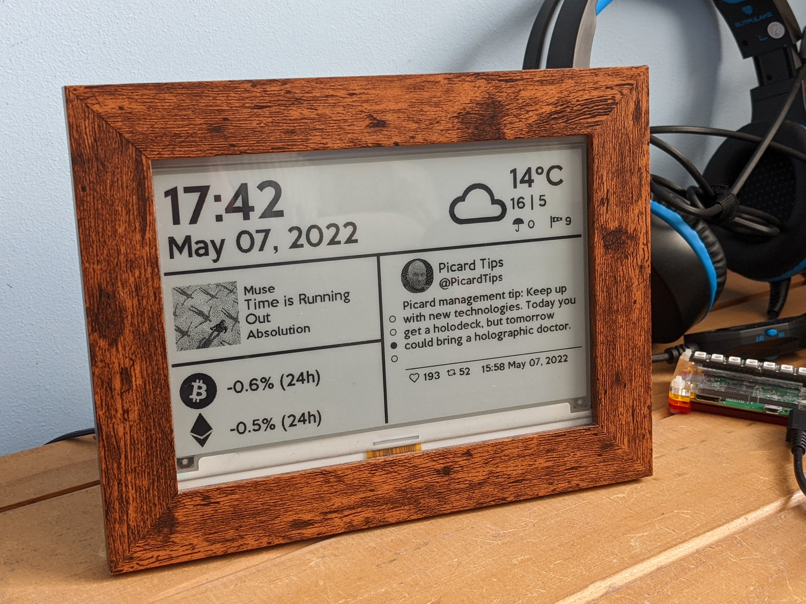

# e-paper-dashboard

> Requires Python >= 3.7

E-paper photo frame Python app for Waveshare 7.5in V2 e-paper display with
information widgets. Runs in two modes - `detailed` and `summary`.



_Detailed mode_

### Detailed mode

Updates up to once a minute, variable per-widget. Included static widgets:

* Time and date
* Current weather - type, temperature, day high/low, chance of precipitation,
  and wind speed using a weather API.
* Now Playing track with art from Spotify API.
* 'On this day' information.

Pages of widgets that rotate once a minute:

* 5 news headlines from BBC News in a chosen category.
* Next 5 days weather forecast.
* Latest tweet from a chosen Twitter account.
* One of a number of quotes obtained from
  [https://type.fit/api/quotes](https://type.fit/api/quotes).
* NASA Astronomy Picture of the Day.

### Summary mode

Updates once per hour. All widgets are static:

* Time and date
* Current weather - type, temperature, day high/low, chance of precipitation,
  and wind speed using a weather API.
* 5 news headlines from BBC News in a chosen category.
* Next 5 days weather forecast.

## Setup

Follow the steps in the
[Waveshare wiki](http://www.waveshare.com/wiki/7.5inch_e-Paper_HAT) to install the
required libraries for the 7.5 inch V2 e-paper display:

```shell
sudo apt-get install python3-pip python3-pil python3-numpy
sudo pip3 install RPi.GPIO spidev
```

Install additional Python dependencies:

```shell
pip3 install termcolor spotipy pillow
```

## Configuration

Copy `config.json.example` and add values appropriate to you:

| Name | Type | Description |
|------|------|-------------|
| `MODE` | String | Mode to run - `detailed` widgets, or `summary` data only. |
| `LATITUDE` | String | Local latitude |
| `LONGITUDE` | String | Local longitude |
| `WEATHER_KEY` | String | Key for the weather API |
| `NEWS_CATEGORY` | String | BBC News category identifier, from the list below |
| `NEWS_MODE` | String | Display news in `rotation` or as a `list` |
| `TWITTER_SCREEN_NAME` | String | Twitter name of an account to show latest tweet |
| `TWITTER_BEARER_TOKEN` | String | Twitter API Bearer token |
| `SPOTIFY_CLIENT_ID` | `String` | Spotify OAuth flow client ID |
| `SPOTIFY_CLIENT_SECRET` | `String` | Spotify OAuth flow client secret |
| `SPOTIFY_REDIRECT_URI` | `String` | Spotify OAuth flow redirect URI |

> Some unused widgets/modules may require additional parameters.

Available BBC News categories:

* `headlines`
* `world`
* `uk`
* `politics`
* `health`
* `education`
* `science_and_environment`
* `technology`
* `entertainment_and_arts`


## Run

Run with Python 3.x:

```shell
python3 main.py
```

`crontab` can be used to run on boot:

```
@reboot pip3 install spotipy termcolor; python3 /home/pi/code/e-paper-dashboard/main.py > /home/pi/e-paper-dashboard.log 2>&1
```

When run on a platform other than Raspberry Pi (i.e: not ARM) the display image
is written to `./render.png` instead, which is useful for quickly testing
changes.
